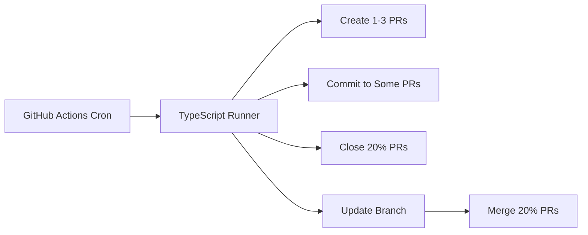

GitHub CI automation runs on a 5-minute schedule and only touches bot-created PRs defined by the `auto/` branch prefix and `automation` label. The workflow uses `actions/checkout@v4.2.0` and `actions/setup-node@v4.0.2` with Node 20, then runs the TypeScript automation. The automation writes to `automation/heartbeat.txt` so changes are isolated from product code.

```ts
export const automationPolicy = {
  branchPrefix: "auto/",
  label: "automation",
  heartbeatPath: "automation/heartbeat.txt",
  baseBranch: "main",
  cadenceMinutes: 5,
  closeRatio: 0.2,
  mergeRatio: 0.2,
};
```



Related: [../summary.md](../summary.md), [../practices.md](../practices.md)
