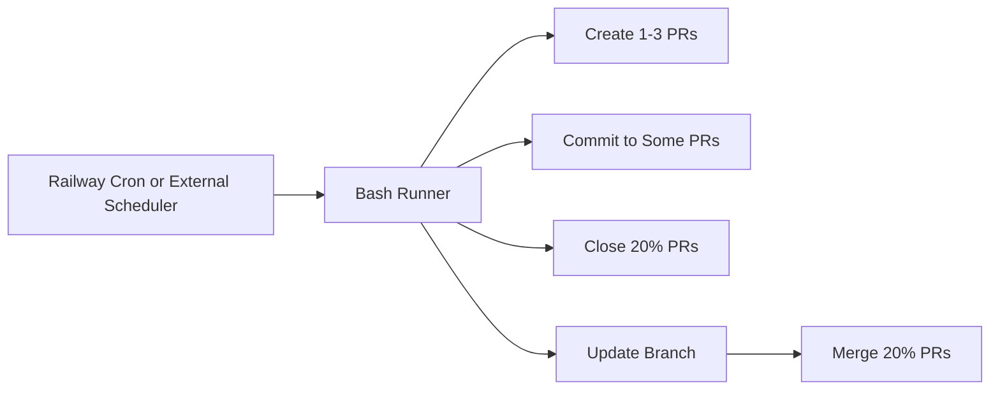

Automation is now run outside GitHub Actions (for example via Railway cron) and only touches bot-created PRs defined by the `auto/` branch prefix and `automation` label. The runner is `scripts/github-ci.sh` (bash with git + `gh` + `jq`) and writes new heartbeat files under `automation/` for each branch update to avoid merge conflicts. It requires `GITHUB_TOKEN` plus `GITHUB_REPOSITORY` or `REPO_FULL` for API access, can reuse or clone the repository if it is not already inside a git checkout, and rewrites the `origin` remote to an HTTPS token URL so pushes work in headless containers.

The runner lists automation PRs with `gh pr list` and filters them by branch prefix or label using `jq`. Merge targets attempt a rebase via `gh api PUT /repos/{owner}/{repo}/pulls/{number}/update-branch` before `gh pr merge`, but merges still proceed even if the rebase fails. `AUTOMATION_FILE_PATH` provides the directory prefix for heartbeat files.

```sh
export BASE_BRANCH="main"
export AUTOMATION_BRANCH_PREFIX="auto"
export AUTOMATION_LABEL="automation"
export AUTOMATION_FILE_PATH="automation/heartbeat.txt"
export CLOSE_RATIO="0.2"
export UPDATE_RATIO="0.2"
export MERGE_RATIO="0.2"
```

```sh
docker run --rm \
  -e GITHUB_TOKEN=*** \
  -e REPO_FULL=dxta-dev/pr-commit-generator \
  -e BASE_BRANCH=main \
  -e AUTOMATION_BRANCH_PREFIX=auto \
  -e AUTOMATION_LABEL=automation \
  -e AUTOMATION_FILE_PATH=automation/heartbeat.txt \
  -v "$PWD":/app \
  -w /app \
  pr-commit-generator:automation
```

```sh
./scripts/github-ci.sh
```



Related: [../summary.md](../summary.md), [../practices.md](../practices.md)
