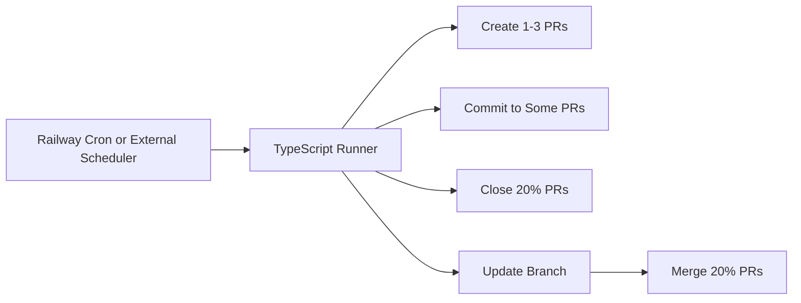

Automation is now run outside GitHub Actions (for example via Railway cron) and only touches bot-created PRs defined by the `auto/` branch prefix and `automation` label. The runner uses Node 24 in `Dockerfile`, writes to `automation/heartbeat.txt` so changes are isolated from product code, and requires `GITHUB_TOKEN` plus `GITHUB_REPOSITORY` or `REPO_FULL` for API access.

```ts
export const automationPolicy = {
  branchPrefix: "auto/",
  label: "automation",
  heartbeatPath: "automation/heartbeat.txt",
  baseBranch: "main",
  cadenceMinutes: 5,
  closeRatio: 0.2,
  mergeRatio: 0.2,
};
```

```sh
docker run --rm \
  -e GITHUB_TOKEN=*** \
  -e REPO_FULL=dxta-dev/pr-commit-generator \
  -e BASE_BRANCH=main \
  -e AUTOMATION_BRANCH_PREFIX=auto \
  -e AUTOMATION_LABEL=automation \
  -e AUTOMATION_FILE_PATH=automation/heartbeat.txt \
  pr-commit-generator:automation
```



Related: [../summary.md](../summary.md), [../practices.md](../practices.md)
