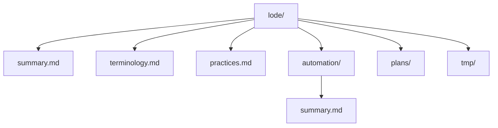

# Lode Map

- [summary.md](summary.md)
- [terminology.md](terminology.md)
- [practices.md](practices.md)
- automation/
- [automation/summary.md](automation/summary.md)
- plans/
- tmp/

```ts
export const lodeIndex = [
  "summary.md",
  "terminology.md",
  "practices.md",
  "automation/",
  "automation/summary.md",
  "plans/",
  "tmp/",
];
```



Related: [summary.md](summary.md), [terminology.md](terminology.md), [practices.md](practices.md), [automation/summary.md](automation/summary.md)
