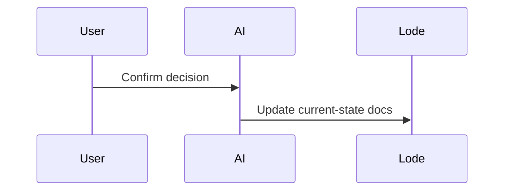

The Lode is updated immediately after confirmed decisions so the repository always reflects the current system state, not a changelog.

```ts
export const recordDecision = (decision: string) => {
  return { decision, recordedInLode: true };
};
```



Related: [summary.md](summary.md), [terminology.md](terminology.md), [lode-map.md](lode-map.md)
