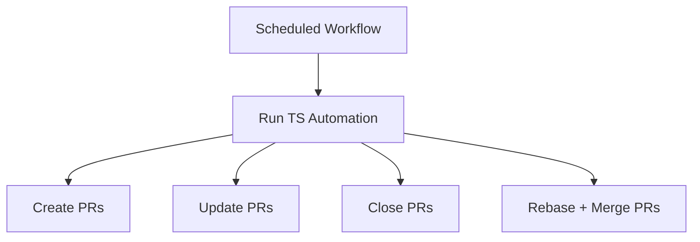

This repository automates GitHub PR churn via a scheduled workflow that creates, updates, closes, and merges automation-scoped PRs on a 5-minute cadence using a TypeScript runner.

```ts
export type AutomationScope = {
  branchPrefix: string;
  label: string;
  heartbeatPath: string;
};
```



Related: [terminology.md](terminology.md), [practices.md](practices.md), [lode-map.md](lode-map.md), [automation/summary.md](automation/summary.md)
