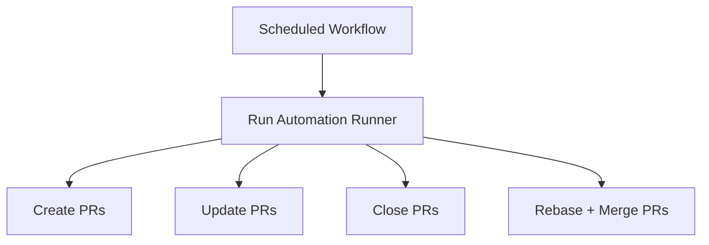

This repository automates GitHub PR churn via a scheduled workflow that creates, updates, closes, and merges automation-scoped PRs on a 5-minute cadence using the bash `gh` runner (`scripts/github-ci.sh`).

```sh
export AUTOMATION_BRANCH_PREFIX="auto"
export AUTOMATION_LABEL="automation"
export AUTOMATION_FILE_PATH="automation/heartbeat.txt"
```



Related: [terminology.md](terminology.md), [practices.md](practices.md), [lode-map.md](lode-map.md), [automation/summary.md](automation/summary.md)
