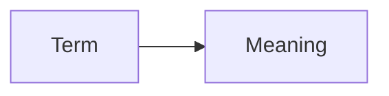

Lode - AI-owned structured memory repository under lode/.
Lode Map - Hierarchical index of all Lode files in lode/lode-map.md.
Session Scraps - Temporary notes saved in lode/tmp/.
Invariant - A rule the system must always satisfy.

```ts
export type Invariant = {
  name: string;
  statement: string;
};
```



Related: [summary.md](summary.md), [practices.md](practices.md)
